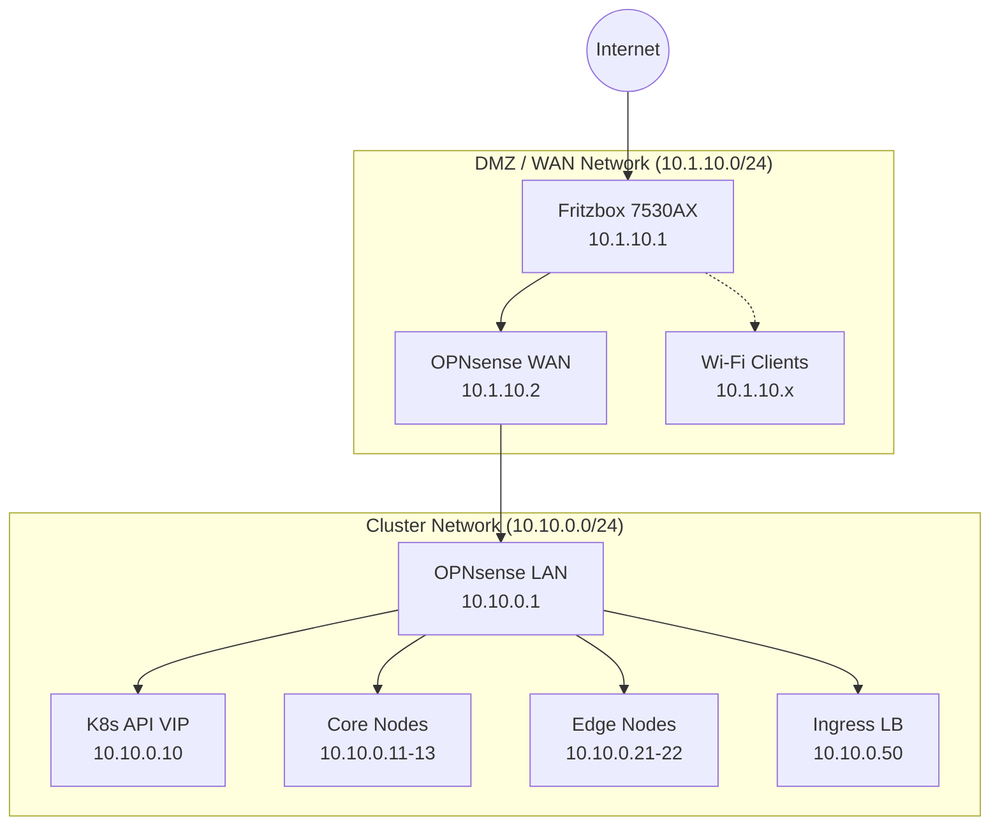

# Networking: Fritzbox & OPNsense Integration

This document outlines the authoritative network design for the homelab, ensuring seamless access for Wi-Fi clients to cluster services.

## Overview

The cluster lives behind an **OPNsense** router, which itself is behind a **Fritzbox 7530AX**.

## Mandatory Configuration

### 1. Fritzbox Static Route
To allow Wi-Fi clients (10.1.10.x) to reach the cluster (10.10.0.x), a static route must be configured in the Fritzbox.

- **Destination**: `10.10.0.0`
- **Netmask**: `255.255.255.0`
- **Gateway**: `10.1.10.2` (OPNsense WAN IP)

### 2. OPNsense Firewall Rules
The OPNsense WAN interface must allow traffic from the Fritzbox network to the Cluster network.

- **Action**: Pass
- **Interface**: WAN
- **Protocol**: TCP/UDP
- **Source**: `10.1.10.0/24`
- **Destination**: `10.10.0.0/24`
- **Ports**: 80, 443, 6443 (Talos API)

### 3. Split DNS (Unbound)
All internal services are resolved via OPNsense Unbound.

- **Internal Zone**: `home.arpa`
- **Host Overrides**:
    - `jellyfin.home.arpa` -> `10.10.0.50`
    - `opencloud.home.arpa` -> `10.10.0.50`
    - `wol.home.arpa` -> `10.10.0.60`

#### Client DNS Setup
Fritzbox should be configured to use OPNsense as its primary DNS server:
- **Primary DNS**: `10.1.10.2`

## Traffic Flow Examples

### Wi-Fi Client -> Jellyfin
1. Client looks up `jellyfin.home.arpa`.
2. OPNsense returns `10.10.0.50`.
3. Client connects to `10.10.0.50` via Fritzbox -> OPNsense (routed).
4. No NAT or port forwarding required.

### Pod -> Internet
1. Pod sends traffic to `10.10.0.1` (Gateway).
2. OPNsense routes to `10.1.10.1` (Fritzbox).
3. Fritzbox performs NAT and sends to Internet.
